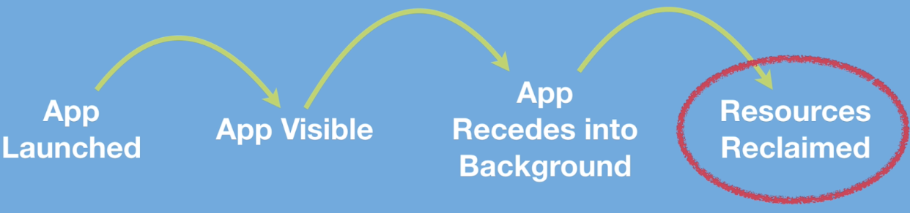

# AppLifecycle-199-Section-15

## App Lifecycle

## Location of app lifecycle methods
 
AppDelegate.swift and the SceneDelegate.swift files that the app lifecycle methods are found.

## Previous to Xcode 11

We only had one file which was the AppDelegate for app lifecycle

## As of iOS 13 

Especially with iPadOS, apps now can run in multiple windows. What this means is that there can be multiple windows running different instances of your app. In other words, there are two separate scenes. That's why we now get a SceneDelegate that reports back to us on the lifecycle of each of these windows.

## SceneDelegate 

All it does is it treats each of these windows being open as a separate scene. So the way works in apps that support scenes is that events that are common to the app are handled in the ApplicationDelegate and all the other lifecycle callbacks are in the SceneDelegate.

## Note - 1

What's common to the app as a whole and handled by the application delegate? Well, it's things like being launched or receiving a time change from the network carrier.

## Note - 2

What does the SceneDelegate handle? Well, it'll be things like a window becoming visible or going into the background.

## Note - 3

print(#function)

